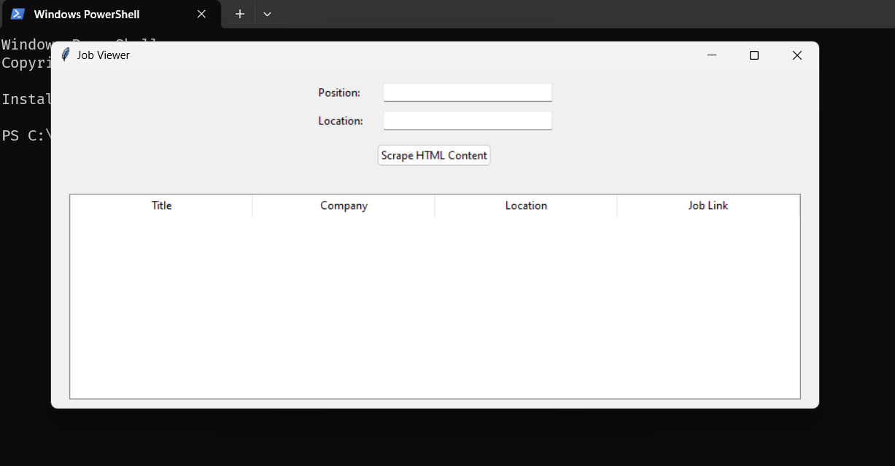
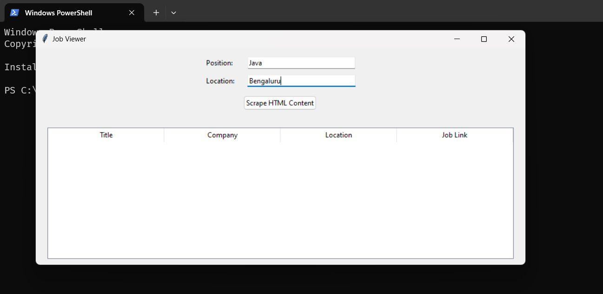
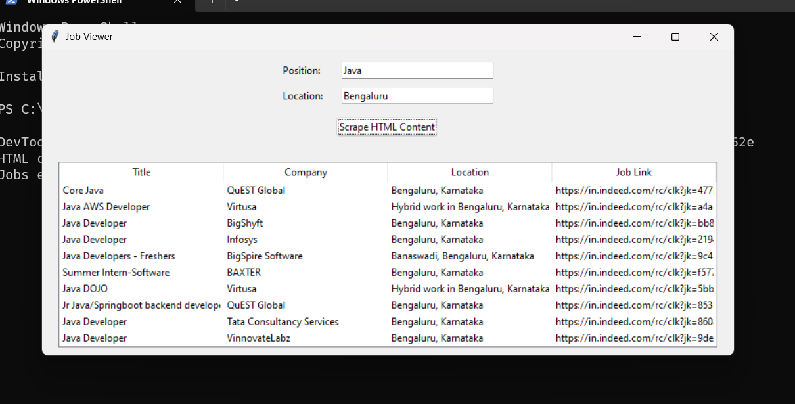
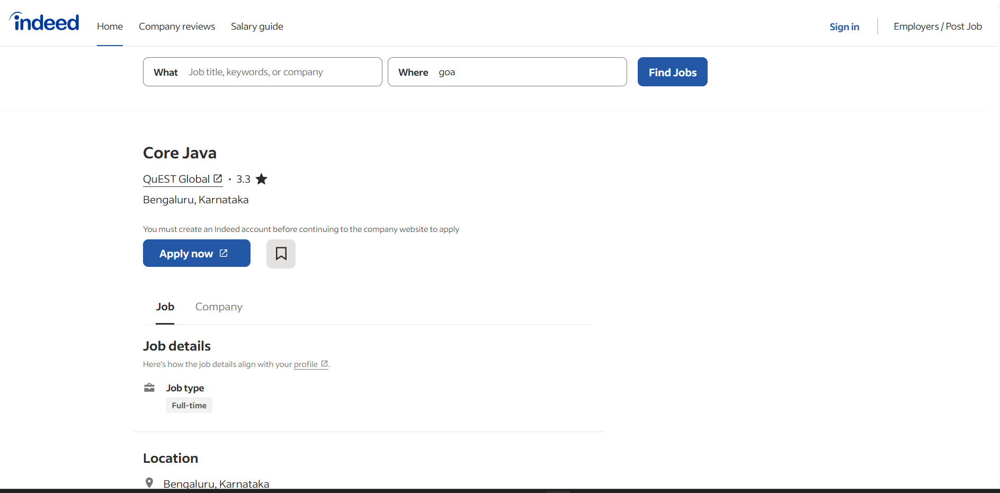

# Job Scraper and Viewer

This is a Tkinter-based job scraper and viewer application that allows users to search for jobs on Indeed based on position and location. The application scrapes job listings, saves them to a CSV file, and displays them in a GUI.
## ScreenShots







## Features

- Scrape job listings from Indeed based on the user's specified position and location.
- Save scraped job listings to a CSV file.
- Load and display job listings in a table format within a GUI.

## Requirements

To run this application, you need to install the following Python packages:

- `requests`: For sending HTTP requests.
- `beautifulsoup4`: For parsing HTML and extracting data.
- `ttkthemes`: For additional Tkinter themes.
- `tkinter`: For creating the GUI (usually comes pre-installed with Python).

You can install the required packages using pip:

```sh
pip install requests beautifulsoup4 ttkthemes

Setup
Clone the Repository (if applicable):
If you have a Git repository, clone it using:

sh
Copy code
git clone <repository-url>
cd <repository-directory>
Install Dependencies:
Ensure you have Python 3 installed. Install the necessary packages:

sh
Copy code
pip install requests beautifulsoup4 ttkthemes
Usage
Run the Application:
Execute the script using Python:

sh
Copy code
python <script-name>.py
Enter Job Search Details:

Open the application.
Enter the job position (e.g., "Software Engineer") in the "Position" field.
Enter the job location (e.g., "Bangalore") in the "Location" field.
Scrape Jobs:

Click the "Scrape Jobs" button.
The application will scrape job listings from Indeed based on the provided position and location.
A CSV file with the job listings will be saved in the same directory as the script.
View Job Listings:

The job listings will be displayed in a table format within the GUI.
You can click on job links in the table to view detailed job postings in your web browser.
Sample Output
After scraping, the job listings are saved to a CSV file named based on the position (e.g., Software_Engineer_jobs.csv). The GUI will display a table with columns for Title, Company, Location, and Job Link.

Troubleshooting
Ensure you have a stable internet connection.
Check for typos in the position and location fields if no results are returned.
If you encounter any issues, verify that the required packages are installed and up-to-date.
License
This project is licensed under the MIT License - see the LICENSE file for details.


author Tharun R
